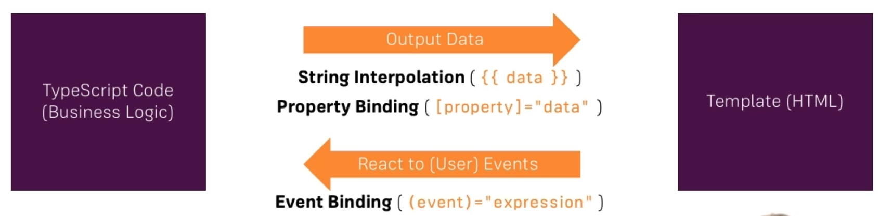

# Contents:
1. [Getting Started](#getting_started)
2. [The Basics](#the_basics)
3. [Components & Databinding](#components_&_databinding)
4. [Directives](#directives)
5. [Services & Dependency Injection](#)
6. [Routing](#)
7. [Observables](#)
8. [Forms](#)
9. [Pipes](#)
10. [Http](#)
11. [Authentication](#)
12. [Optimizations & NgModules](#)
13. [Deployment](#)
14. [Animations & Testing](#)

# 1. Getting Started?
<a name='getting_started'></a>

Angular is a JavaScript Framework which allows us to create reactive Single-Page-Applicaitons.
## Creating a new project:
```shell
$ng new my-first-app
```
Running this command will create a new project. It will ask a few questions around bindings, routing and styling. Choose as per your preference, and voila- your project is ready.  

After the project is build, go to that directory and run the command `ng serve` to start the application.
```shell
$cd my-first-app
$ng serve
```
This will start the application on port 4200 by default.

File structure related to the app running:  
_package.json_: Just like any other node/npm app, this conains all the third party packages and dependecies that the project needs to run correctly. This is divided into two parts: dependencies and devDependencies. The dependencies are the packages that the app needs to run, whereas the devDependencies are the packages that are useful during the development.  
_node-modules_: This directory saves all the packages that are listed in package.json.  
_src_: This directory has all the code for the project/app. The files/directores outside that are configuration items, and do not contribute much to app functionality.  

In src directory, there is another directory called 'app'. This directory saves all the code that is mainly responsible for working of the angular app.
The file _app.component.html_ will be rendered on the browser. The file _app.component.ts_ will be converted into javascript and will be part of the script that will be imported into the static file.

## How Angular works:
Now looking at the rendered page in the browser, the html code for that is:
```html
<!doctype html>
<html lang="en">
<head>
  <meta charset="utf-8">
  <title>MyFirstApp</title>
  <base href="/">
  <meta name="viewport" content="width=device-width, initial-scale=1">
  <link rel="icon" type="image/x-icon" href="favicon.ico">
<link rel="stylesheet" href="styles.css"></head>
<body>
  <app-root></app-root>
<script src="runtime.js" defer></script><script src="polyfills.js" defer></script><script src="vendor.js" defer></script><script src="main.js" defer></script></body>
</html>
```
The html file used is the __index.html__ in the _src_ directory, without the inclusion of script tags- which are injected automatically by angular by compiling __app.component.ts__.   
Here we can see that there is a tag called `<app-root></app-root>`. And when taking a look at the file _app.component.ts_, it has a component called `app-root`:
```typescript
import { Component } from '@angular/core';

@Component({
  selector: 'app-root',
  templateUrl: './app.component.html',
  styleUrls: ['./app.component.css']
})
export class AppComponent {
  title = 'my-first-app';
}
```
## Making small changes to the app:
_Problem Statement:_ Make changes to the app, so that there is an input box and when we enter something in that input box, it displays the same in a paragraph below that.  
Changes that need to be made:  
* __app.component.html:__ Replace the old code with the below text:
```html
<input type="text" [(ngModel)]="name">
<p>{{ name }}</p>
```
* __app.component.ts:__ In the class appcomponent, change the name of the variable to `name` from title.
* __app.module.ts:__  These lines need to be added to the file:
```typescript
import {FormsModule} from '@angular/forms';

// Add FormsModule to the imports
imports: [
    BrowserModule,
    FormsModule
  ]
```
This solves our task required. More on what each thing does later.

## What is TypeScript?
* TypeScript is a superset of JavaScript. It offers more feature than vanilla JS-- Types- Strong Typing, Classes, Interfaces, etc.
* TypeScript doesn't run on the browser, thus it is compiled to JavaScript, which is done by the Angular CLI.

# 2. The Basics:
<a name='the_basics'></a>

## How the application starts/works?
* `main.ts` is the first file to compile when we type in the command `ng serve`.  
* __main.ts:__  
```typescript
import { enableProdMode } from '@angular/core';
import { platformBrowserDynamic } from '@angular/platform-browser-dynamic';

import { AppModule } from './app/app.module';
import { environment } from './environments/environment';

if (environment.production) {
  enableProdMode();
}

platformBrowserDynamic().bootstrapModule(AppModule)
  .catch(err => console.error(err));
```
* Here we're importing the module from the app directory, and then the line `platformBrowserDynamic().bootstrapModule(AppModule)` bootstaps the application module, i.e., it starts up the application module.  
* `main.ts` bootstraps the AppModule using `app.module` which is the file `app.module.ts`.  
* In __app.module.ts:__
```typescript
import { BrowserModule } from '@angular/platform-browser';
import { NgModule } from '@angular/core';

import { AppComponent } from './app.component';

@NgModule({
  declarations: [
    AppComponent
  ],
  imports: [
    BrowserModule
  ],
  providers: [],
  bootstrap: [AppComponent]
})
export class AppModule { }

```  
* `app.module.ts` imports and bootstraps a specific component using `app.component`, both `app.component.html` and `app.component.ts`.  
* The file that is rendered is the `index.html` file in the src directory. But how this works is, in the index.html file, there is a tag given as `<app-root></app-root>`. In the file `app.component.ts`, there is a section of code:
```typescript
@Component({
  selector: 'app-root',
  templateUrl: './app.component.html',
  styleUrls: ['./app.component.css']
})
```
* The value in the selector object is the tag that is going to be replaced from the `index.html` file. And the page given in the templateUrl will be the replacement.  
* So, if you change the contents of the file `app.component.html`, the contents rendered on the browser changes.
* And how this happens is when we type the command `ng serve`, the CLI creates javascript bundles by compiling the above files and does the automatic imports of the right bundled scripts where the tag is given in the `index.html`.  

## A detailed look at Components(@Component):
* Components are a key feature in Angular. The whole application is built using a couple of components, which we create.  
* We start with the AppComponent or the root component which holds the entire application.  
* We'll be adding or nesting other components to this AppComponent. We can divide the screen into multiple components like header, main area, sidebar, footer, etc. and each component will have it's own html, styling and business logic.  
* And this allows us to split up the application into multiple reusable components which can be used more than once.  

## Creating a new component:
* AppComponent is a special component which angular bootstraps to start the application.  
* The selector of AppComponent(`<app-root></app-root>`) lies on the `index.html` but all the other components we create, their selector won't be added to the `index.html` but to the `app.component.html` file.  
* Usually, for a new component, there is a new directory(name of the component) in the app directory which has all it's component files.  
* In this directory we create new files. For example, the name of our component is `server`, so the name of the files should be `server.component.ts` & `server.component.html`.  
* The contents of the `server.component.ts` file should be:
```typescript
import { Component } from '@angular/core';

@Component({
  selector: 'app-server',
  templateUrl: './server.component.html'
})
export class ServerComponent {

}
```
* The contents of the `server.component.html` file should be:
```html
<h2>Testing how the Components work in Angular</h2>
```
__NOTE:__ Angular uses components to build webpages and uses modules to bundle different pieces(for example Components) of the app called packages.   
* To use this Component, we need to register in the AppModule and thus `app.module.ts` needs a little change, as by default Angular doesn't scan all the files.  
* The Components will be added to the `declaration` section of the `@NgModule` decorator. For this, we need to first import the component:
```typescript
import { BrowserModule } from '@angular/platform-browser';
import { NgModule } from '@angular/core';

import { AppComponent } from './app.component';

// New Addition:
import { ServerComponent } from './server/server.component';

@NgModule({
  declarations: [
    AppComponent,
    ServerComponent // New Addition
  ],
  imports: [
    BrowserModule
  ],
  providers: [],
  bootstrap: [AppComponent]
})
export class AppModule { }
```
* To use this Component, we need to add the selector as an html tag in the file `app.component.html`. This will display the contents of the file `server.component.html` on the browser.  
__NOTE:__   
* While importing the classes/files, we don't need to add extensions because they will be added automatically by Webpack when it bundles the application.
* The import section in the decorator `@NgModule` allows us to add other modules to this module for use.  

### Creating a new component using the Angular CLI:
To create a new component, the command used is:  
```bash
$ng generate component servers
  #or
$ng g c servers
```
This also takes care of importing and registering the component in the module. The only thing that will be left will be to add the selector in the file `app.component.html`.  

### Using inline template:
Replace the `templateUrl` section in the `@Component` decorator with just `template` and we don't need an additional `.html` file for templating. Example:
```typescript
@Component({
  selector: 'app-server',
  template: '<app-server></app-server>',
  style: ''
})
```
To use multi-line strings, use backtics. For using styles, use either styleUrl or styles for inline, which take an array for css styles.  

### Different selector:
The selectors don't just need to be an HTML tag. If you want to use the selector as an HTML attribute/property, use selector as:
```TypeScript
@Component({
  selector: '[app-servers]',
  templateUrl: './server.component.html',
  styleUrl: './servers.component.css'
})
```
For this selector to work, the HTML should look like: `<div app-servers></div>`. This will work for all the selectors that have the attribute: `app-servers`.  
The same goes for class:
```TypeScript
@Component({
  selector: '.app-servers',
  templateUrl: './server.component.html',
  styleUrl: './servers.component.css'
})
```
For this selector to work, the HTML should look like: `<div class="app-servers"></div>`. This will work for all the selectors that have the HTML attribute/tags with property: `app-servers`.  

## Data-Binding:
Databinding means the communication between the typescript code(i.e. the business logic) and the HTML template.  
   
There is also a combination of both: Two-Way-Binding( `[ngModel]="data"` ).  

### String Interpolation:
String Interpolation means that if we want to populate some dynamic value to HTML template, I have to use that in the format: {{ data-variable }}. Example:
In server.component.ts:
```TypeScript
export class ServerComponent {
  serverId: number = 10;
  serverStatus: string = 'Offline';
}
```
Inorder to display that in the HTML page, we have to make changes in the file server.component.html as:
```HTML
<h5>Status of server with ID: {{ serverId }} is: {{ serverStatus }}</h5>
```
This is called String Interpolation is because the statement given between the curly braces(`{{}}`) should result in a string. That can be a string directly or a function call as well that can return string or something which can be converted to a string.  
The restriction to using this is that we cannot use multi-line expressions in between the curly braces.

### Property Binding:
We use property binding to make changes to some property dynamically. It is done using square brackets.
For example:
```html
<button type="button" name="button" class="btn btn-primary" [disabled]="allowNewServer">Add Server</button>
```
And the contents of the class should be:
```typescript
allowNewServer: boolean = false;
constructor() {
  setTimeout(() => {
    this.allowNewServer = true;
  }, 5000);
}
```  
After this, the button will disable after five seconds automatically. Thus we have bound an attribute to a property/variable. This is called property binding.

### Property Binding vs String Interpolation:
String Interpolation should be used when we want to output something or print some text. If a change to a property is needed, whether be it of HTML element or that of a directive or a component, then property binding should be used.

## Reacting to Events(Event Binding):
Some methods/logic can be bound to some HTML events using the event binding mechanism. For example:
```HTML
<button type="button" name="button" class="btn btn-primary"
    [disabled]="!allowNewServer"
    (click)="onCreateServer()">Create Server</button>
<hr>
{{ serverCreationStatus }}
```
The code behind this is:
```TypeScript
allowNewServer: boolean = false;
serverCreationStatus = '----No Server was created.----';
constructor() {
  setTimeout(() => {
    this.allowNewServer = true;
  }, 5000);
}
onCreateServer() {
  this.serverCreationStatus = 'Server was created.';
}
```
### Passing and Using Data with Event Binding:
This is done by using the keyword: `$event`. `$event` is a special reserved keyword which we can be used in the template during event binding.  
For this, we can use the same example we used in the earlier section to learn this:  
```HTML
<label for="testing">Server</label>
<input type="text" name="testing" id="testing" class="form-control" (input)="onUpdateServerName($event)">
{{ serverName }}
<button class="btn btn-primary" [disabled]="isDisable" (click)="onCreateServer()">Add Server</button>

{{ serverCreationStatus }}
```
In this case here, what it does is, whenever we input something in the text field, an event is generated and the function `onUpdateServerName()` function is called. So, if we input anything from the keyboard, it will call as many times as there are changes made in the text field. And in the event object structure, there is a property called `event.target.value` which changes to what is in the input field.  
The code behind this will be:
```TypeScript
  isDisable: boolean = true;
  serverName: String = null;
  serverCreationStatus: String = "No Server was created";

  constructor() {
      setTimeout(() => {
          this.isDisable = false;
      }, 5000);
  }

  onCreateServer(): void {
      this.serverCreationStatus = "Server was created. Name: " + this.serverName;
  }

  onUpdateServerName(event: any) {
      this.serverName = event.target.value;
  }
```
So if we enter in the input field as _Test-Server_, the value of `this.serverName` will be the text that we entered in the text field. This is how the data flow works with event binding.

## Two way Binding:
With two-way data binding, we combine the property and event binding. This is done by combining syntaxes as well- `[()]` and using a special directive called ngModel. How to use this:
```HTML
<label for="testing">Server</label>
<input type="text" name="testing" id="testing" class="form-control" [(ngModel)]="serverName">
{{ serverName }}
<button class="btn btn-primary" [disabled]="isDisable" (click)="onCreateServer()">Add Server</button>

{{ serverCreationStatus }}
```
What this does is this input field along with the input event is bound to the property called `serverName`. And since it is directly bound to the property, we no longer need the function called `onUpdateServerName()`. The input field will be pre-populated with the default value given to the property `serverName`. How the back-ground code looks like:
```TypeScript
isDisable: boolean = true;
  serverName: String = "Test-Server";
  serverCreationStatus: String = "No Server was created";

  constructor() {
      setTimeout(() => {
          this.isDisable = false;
      }, 5000);
  }

  onCreateServer(): void {
      this.serverCreationStatus = "Server was created. Name: " + this.serverName;
  }
```
__NOTE:__ Review on what different binding looks like:
1. String interpolation: Used to display some information on the screen. Achieved by using `{{ }}`. Can perform single line code in between this, but should return string.
2. Property Binding: Used to bind an HTML tag/attribute to a property/variable of the same class. Achieved by using `[]`.  
3. Event Binding: Used to tie an action to an event occured on the HTML page and bind it to a function on the class to perform that action. Achieved by using `()`.  
4. Two-way Binding(Property + Event binding): Used to bind an event to an attribute. We don't need to use a separate function to set properties for this to work. Achieved by using `[()]` and a directive called `ngModel`.

__All the above bindings can only be bound to either inline single line code snippets or to the class level properties.__
