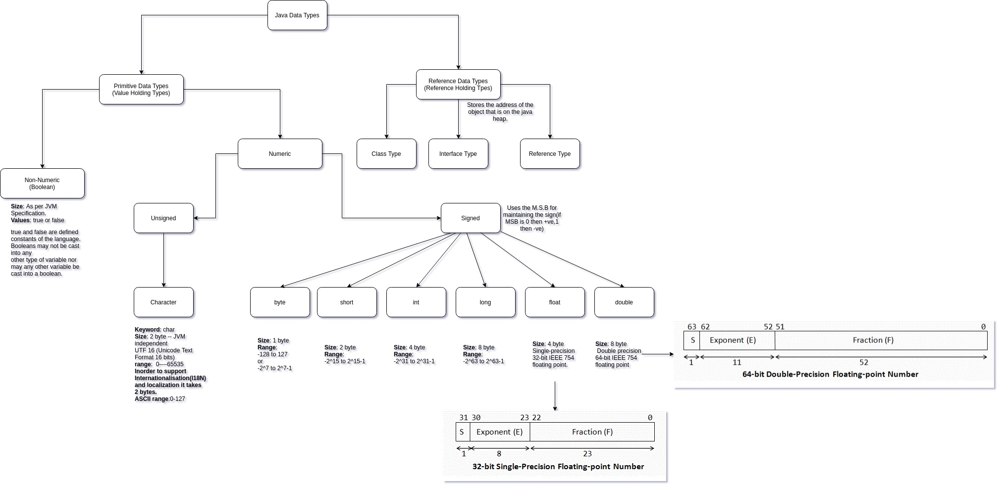

# Contents:
1. [Day-1](#day-1)
    * [How Java Programs work](#how_java_programs_work)
    * [Why Java?](#why_java)
    * [JDK vs JRE vs JVM](#jdk_vs_jre_vs_jvm)
    * [JVM Architecture](#jvm_architecture)
    * [More about JIT Compiler](#more_about_jit_compiler)
    * [Writing the first Java Program](#writing_the_first_java_program)
    * [How to run Java Program](#how_to_run_java_programs)
    * [Some important notes about Java Source Files](#some_important_notes_about_java_source_files)
    * [Java Data-Types](#java_data_types)
    * [Accepting Input using Scanner Class](#accepting_input_using_scanner)

## Day-1
<a name='day-1'></a>

### How Java Programs work:
<a name='how_java_programs_work'></a>

For any java program to run these are the steps that it needs to follow:
* Write the source code in a `.java` file. For example, `Hello.java`.
* The source code, wrote in a `.java` file is compiled using software called compiler.
* This generates a file with an extension of `.class`. So the file which will be generated will be `Hello.class` for the java source code `Hello.java`. This file is used to run the code.
* This `.class` file is not meant to run on any particular platform. This means that whether we run the program on a Windows, Mac or Linux platform, it'll run in the same manner.
* This is the reason why it is said that, write once- run anywhere language.

When we compile the source code, it produces an intermediatory byte code(`.class` file). This intermediatory byte code is not meant for any real platform, but this can only run on __JVM(Java Virtual Machine)__. The __JVM__ is a java runtime environment, which translates from platform independent byte code to platform specific native code. This is called interpretation(runtime translation).

### Why Java?
<a name='why_java'></a>

When Starting Java, one thing to understand is- Why Java? What makes the Java Language this popular?
Some other benefits of using Java:
* Simple & Robust
* Platform or Architecture independent
* Secure
* Automatic Memory Management
* Inherent Multi-threaded support
* Object Oriented support -- Encapsulation,Inheritance & polymorphism
* Excellent I/O support
* Inherent networking support for TCP/IP , UDP/IP programming.

Steps to run a java program:
* Type the source code in a file with extension`.java ` file. For example, 'Test.java'.
* Run the command `javac Test.java`. This will output of a file with an extension `.class`. For our case, 'Test.class'.
* After the `.class` file is generated, run the command `java Test` to run the program. The `.class` part should be removed.

### JDK vs JRE vs JVM:
<a name='jdk_vs_jre_vs_jvm'></a>

  
From the above diagram, we can see that JDK(Java Development Kit) can be divided into two section: _Java DEV Tools_ and _JRE(Java Run-time environment)_.

Java DEV Tools are referred to the applications/tools that are shipped with java for development of applications.

JRE can be further divided into two sections: _Java API Libraries_ and _JVM(Java Virtual Machine)_.

Java API Libraries are the default provided libraries along with the java application which help/support in the development on applications. Under the lib directory, there is a jar file named 'rt.jar' which contains all the packages(bundled collection of functionally similar classes).

And JVM(Java Virtual Machine) is the actual runtime where Java apps run. This consists of multiple sections which can be seen in the sectin below.


__NOTE:__ When we write `import java.io.*;` in a java function, it does n't mean that all the classes in `java.io` package will be loaded in the program, as `java.io` has hundreds of classes, and that'll only slow down the execution of the program. It only loads the classes that are requried in the program. 

### JVM Architecture:
<a name='jvm_architecture'></a>


JVM has various sub components internally. 

1. Class loader sub system: JVM's class loader sub system performs 3 tasks
      * It loads .class file into memory.
      * It verifies byte code instructions.
      * It allots memory required for the program.

2. Run time data area: This is the memory resource used by JVM and it is divided into 5 parts
      * Method area: Method area stores class code and method code. (metaspace in Java SE 8)
      * Heap: Objects are created on heap.
      * Java stacks: Java stacks are the places where the Java methods are executed. A Java stack
	  contains frames. On each frame, a separate method is executed.
      * Program counter registers: The program counter registers store memory address of the
	  instruction to be executed by the micro processor.
      * Native method stacks: The native method stacks are places where native methods 
	  (for example, C language programs) are executed. Native method is a function,
	  which is written in another language other than Java.

3. Native method interface: Native method interface is a program that connects native methods 
	libraries (C header files) with JVM for executing native methods.

4. Native method library: holds the native libraries information.

5. Execution engine: Execution engine contains interpreter and JIT compiler, which converts byte 
	code into machine code. JVM uses optimization technique to decide which part to be interpreted
	and which part to be used with JIT compiler. The HotSpot represent the block of code executed
	by JIT compiler.

When class loader loads the classes on JVM, the HotSpot profiler finds out which section/piece of code is executed a lot of times, and thus if once compiled, can be used later with little to no calling change. So, the HotSpot profiler finds the HotSpot, and then gives it to the JIT Compiler. And JIT has a cache(local memory) and maintains native code caching, i.e., it saves the native code of the hotspot and whenever it encounters the same calling again, it uses the native code cache, rather than interpreting runtime again.

### More about JIT Compiler:
<a name='more_about_jit_compiler'></a>

The Just In Time Compiler (JIT) concept and more generally adaptive optimization is well known concept in many languages besides Java (.Net, Lua, JRuby).
 
Compiler is "a computer program that transforms the source language into another computer language (the target language)".

Static java compiler (javac) is a compiler that compiles human readable _.java_ files to a byte code that can be interpreted by JVM - _.class_ files. 

<p>JIT Compiler gathers statistics, finds the "hot" code, compiles it from JVM interpreted bytecode (that is stored in .class files) to a native code that is executed directly by Operating System and heavily optimizes it.  Smallest compilation unit is single method. Compilation and statistics gathering is done in parallel to program execution by special threads.During statistics gathering the compiler makes hypotheses about code function and as the time passes tries to prove or to disprove them. If the hypothesis is dis-proven the code is 
deoptimized and recompiled again.</p>

#### What optimizations JIT does?
Let's look closely at more optimizations done by JIT:
* _Inline methods_: instead of calling method on an instance of the object it copies the method to caller code. The hot methods should be located as close to the caller as possible to prevent any overhead. 
* Eliminate locks if monitor is not reachable from other threads
* Replace interface with direct method calls for method implemented only once to eliminate calling of virtual functions overhead
* Join adjacent synchronized blocks on the same object
* Eliminate dead code
* Drop memory write for non-volatile variables
* Remove prechecking NullPointerException and IndexOutOfBoundsException 
    
#### How JIT compiler and JVM work side by side:
* When the Java VM invokes a Java method, it uses an invoker method as specified in the method block of the loaded class object. 
* The Java VM has several invoker methods, for example, a different invoker is used if the method is synchronized or if it is a native method.The JIT compiler uses its own invoker. 
* The JVM check the method access bit for value __ACC_MACHINE_COMPILED__ to notify the interpreter that the code for this method has already been compiled and stored in the loaded class. 
* JIT compiler compiles the method block into native code for this method and stores that in the code block for that method. 
* Once the code has been compiled the __ACC_MACHINE_COMPILED__ bit, which is used on the Sun platform(JVM), is set.

### Writing the first Java Program:
<a name='writing_the_first_java_program'></a>

```java
class Hello {
      public static void main(String[] args) {
            System.out.println("Hello World");
      }
}
```

__Some Points to Note:__
* The above code can be saved in any file with an extension of `.java`.
* When not using any access specifier before the _class_ keywork, it'll use the _default_ access specifer.
* __Default__ access specifier means that when using or invoking the class with access set to _default_, the class will be visible, or can only be invoked from a different class from the same folder(package) and not from any class outside the folder in which the class in question is.
* The only two access specifiers which are available on class level:  
      * __Default__  
      * __Public__  
* If the class is created as a public class, you have to name the file of the source code as same name of the class. That's the reason that one `.java` file cannot have more than one public classes.
* Class is a unit of encapsulation, ie., the data and methods are encapsulated using a class as an encapsulating unit.
* Norms for naming:   
      1. The name of the class should begin with an upper case and then go with camel casing.  
      2. The name of the members(data members and methods) of the class should start with lower case and then go with camel casing.  
* The __main()__ method in a program is the starting point of execution of any program.
* Access specifers of the members of the class(data members and methods), in order of access from narrowest to widest, are:   
      1. __Private__ (Scope: visible within the same class)  
      2. __Protected__ (Scope: visible only to the subclasses/derived classes)  
      3. __Default__(package private) (Scope: visible only in the same folder/package)  
      4. __Public__ (Scope: visible everywhere)  
* The _static_ keyword in _main()_ method defination means that the _main()_ method can be called without creating an object/without instantiation.
* _void_ is a keyword used for the return type of the function. _main()_ method returns nothing. This is different from __C/C++__. That's because when running _C/C++_ we're running the code directly on the OS, and it needs a return to know whether the exuction of the program was a success or not. But since Java Programs don't run directly on the platform/OS, rather than a VM, it doesn't need to return anything back to the OS.
* In the signature of the _main()_ method, it needs a string array as an argument to capture the command line arguments. In Java String is a class in _java.lang_ package, rather than an array of characters like C/C++.
* The first element of the string argument array is the element that is passes. It doesn't represent the name of the program, like C/C++.

__How `System.out.println()` statement works:__
* Whenever a new class is created, `java.lang` package is automatically imported.
* In the `java.lang` package, there is a class called System. 
* The `System` class has a static data member of type `PrintStream`(from `java.io` package) class called as `out`. 
* `PrintStream` class has a lot of overloaded method with name `print()/println()` with different type of arguments.
* Using this data member of the system class, we can call the `print()/println()` method based .
And that's how the print function works.

### How to run Java programs:
<a name='how_to_run_java_programs'></a>

Before compilation of java source code, let's look at the folder structure:  
_src_: All the source code should be in this directory.  
_bin_: All the compiled code(intermeditiary byte code/`.class` files) should be saved in this directory.  

Thus, to compile the source code, use this command:
```bash
javac -d ../bin Hello.java
```
This means that after the compilation, all the `.class` files will be generated in the bin directory.
To run this program, you have to call the name of the class:
```bash
java Hello
```
```output
Hello World
```

__NOTE:__ Even if your program doesn't have a main method, and you try to run it, it doesn't give any compiler error and gives a `.class` file as an output of the compiler. Java thinks that we're compiling this file to be a part of/to be used in any other package. But if we try to run the code generated, it'll give this error:
```output
Error: Main method not found in class Hello, please define the main method as:
   public static void main(String[] args)
or a JavaFX application class must extend javafx.application.Application
```
And the reason being that inorder to run the code, JVM looks for a special function with a signature: `public static void main(Sting[] args)` in order to run the program.  
The same happens for any change in the signature of the main function, eg. `public static void main(String args)`, because the argument list doesn't have an array of Strings, but it has a single String parameter.

### Some important notes about java program source files:
<a name='some_important_notes_about_java_source_files'></a>

* One java source file can contain multiple classes.
* When compiling a single java source file, it'll produce the number of `.class` files as there are classes in the source code. For example:
```java
class Hello {
        public static void main(String[] args) {
                System.out.println("Hello from main");
        }
}

class A{
      // Empty class
}

class B{
      // Empty class
}
```
* When we compile the above source file, it'll produce three `.class` files: Hello.java, A.java, B.java. And when we run these, other than Hello, the others give an error, as there is no main method in them.
* When writing a class, if we give the class a public specifier, we'll have to name the file the same as that of the public class. If we don't then we see this error:
```console
Hello.java:1: error: class Hello2 is public, should be declared in a file named Hello2.java
public class Hello2 {
       ^
1 error
```
* One java source file can never contain more than one public classes, if we do, we see this error:
```console
Hello.java:1: error: class Hello2 is public, should be declared in a file named Hello2.java
public class Hello2 {
       ^
Hello.java:7: error: class A is public, should be declared in a file named A.java
public class A{}
       ^
2 errors
```
      This is becase when we write a public class, we are exposign a stand-alone functionality, which follows design principle of maximizing cohesion and reducing coupling as much as possible.

* Why is main method static in Java? It is so that the main thread of JVM can call the main method without instantiation.

* All java classes, automatically extend/are inherited from `java.lang.Object` class. Thus `java.lang.Object` class is super class of all classes in Java whether it is written by user or given in Java API library. It is root of all class hierarchy in java.
* The name `java.lang.Object` is called the fully qualified class name. `java.lang` is the name of the package of which the Object class is a part of.

* Let's look at one more program:
```java
public class Hello {
    public static void main(String[] args) {
        System.out.println("Hello " + args[0]);
    }
}
```
When running this program, if we don't pass any value to the command line, it'll give the error:
```output
Exception in thread "main" java.lang.ArrayIndexOutOfBoundsException: Index 0 out of bounds for length 0
	at Hello.main(Hello.java:6)
```
This gives an error, because if we don't pass anything when running the program, the args is an empty String array with length as 0. So if we try to access the 1st element of the array, which is not present, it gives `ArrayIndexOutOfBoundsException`.  
The reason it says Exception in thread "main" is because JVM creates a thread which invokes the main method, and thus it is called "main" thread.  
And in the above program if we pass anything other than an integer umber as an argument, it'll give an error/Runtime Exception called `java.lang.NumberFormatException`. So if you pass 4 and e, ie, a string which contains a non-parsable integer, it doesn't give the output as 4 + ASCII value of 'e'. 

### Java Data-Types:
<a name='java_data_types'></a>

The summary of the java data-types has been described in the image below:


### Accepting Input using Scanner Class:
<a name='accepting_input_using_scanner'></a>

#### Why Scanner?
* Scanner Class is used to take input other than command line arguments. 
* The other benefit of using Scanner Class is that we don't have to parse the entered element every time we want the data to be in a type other than String.
* With Scanner Class, we can take inputs while the program is running. It doesn't always have to be at the beginning when running the program.

#### What is Scanner?
* Part of `java.util` package.
* Scanner class can be called as a parser which has an inherent Buffer build into it.
* Scanner can be attached to either a standard input like keyboard, or a text file and it'll work the same way for both of them.
* Scanner can also be attached to a socket to accept/read strings directly from the sockets.
* The default delimiter for a token in the Scanner Buffer is space.

#### Writing the first program using Scanner to take input:
```java
/**
 * Problem statement: Take a number as an input using scanner and test whether 
 */
import java.util.Scanner;
public class TestEven {
    public static void main(String[] args) {

        // Instantiating the Scanner class, since the methods we'll use are non-static methods
        Scanner sc = new Scanner(System.in);
        int num;
        System.out.println("Enter a number to test even or not:");

        // sc.hasNextInt(): Test if the data input in the buffer Integer or not
        if(sc.hasNextInt()) {

            //sc.nextInt(): Read the data input in the buffer as an integer  -- Blocking Method
            num = sc.nextInt();

            if(num % 2 == 0) {
                System.out.println("The number input is even.");
            } else {
                System.out.println("The number input is odd.");
            }
        } else {
            System.out.println("The data entered is not a number and hence is not parsable.");
        }

        // Need to close the handler to the Scanner Buffer.
        sc.close();
    }
}
```
__NOTE:__ If we don't use the `hasNextInt()` method, and we input data other than integer, then it'll give an error of `InputMisMatchException`:
```output
Enter a number to test even or not:
a
Exception in thread "main" java.util.InputMismatchException
	at java.base/java.util.Scanner.throwFor(Scanner.java:939)
	at java.base/java.util.Scanner.next(Scanner.java:1594)
	at java.base/java.util.Scanner.nextInt(Scanner.java:2258)
	at java.base/java.util.Scanner.nextInt(Scanner.java:2212)
	at TestEven.main(TestEven.java:17)
```
So, the `hasNextInt()` method is used to make it failsafe.


Some other Scanner functions for different data-types:
* boolean: hasNextBoolean(), nextBoolean().
* byte: hasNextByte(), nextByte().
* short: hasNextShort(), nextShort().
* int: hasNextInt(), nextInt().
* long: hasNextLong(), nextLong().
* float: hasNextFloat(), nextFloat().
* double: hasNextDouble(), nextDouble().
* String: hasNext(), next().