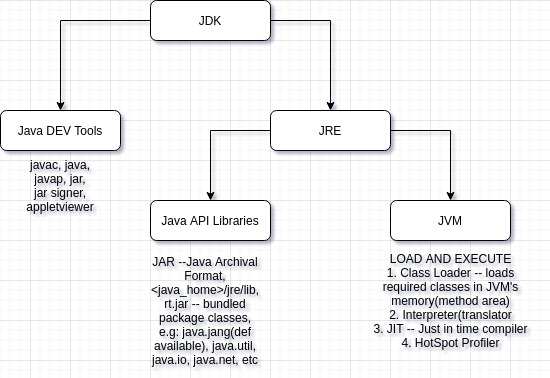
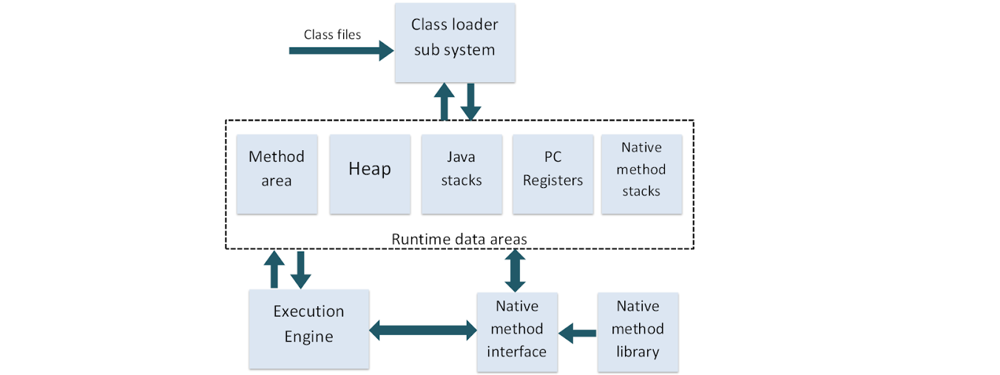

# Contents:
1. [Day-1](#day-1)
    * [How Java Programs work](#how_java_programs_work)
    * [Why Java?](#why_java)
    * [JDK vs JRE vs JVM](#jdk_vs_jre_vs_jvm)
    * [JVM Architecture](#jvm_architecture)

## Day-1

### How Java Programs work:

For any java program to run these are the steps that it needs to follow:
* Write the source code in a `.java` file. For example, `Hello.java`.
* The source code, wrote in a `.java` file is compiled using software called compiler.
* This generates a file with an extension of `.class`. So the file which will be generated will be `Hello.class` for the java source code `Hello.java`. This file is used to run the code.
* This `.class` file is not meant to run on any particular platform. This means that whether we run the program on a Windows, Mac or Linux platform, it'll run in the same manner.

When we compile the source code, it produces an intermediatory byte code(`.class` file). This intermediatory byte code is not meant for any real platform, but this can only run on __JVM(Java Virtual Machine)__. The __JVM__ is a java runtime environment, which translates from platform independent byte code to platform specific native code. This is called interpretation(runtime translation).

### Why Java?

When Starting Java, one thing to understand is- Why Java? What makes the Java Language this popular?
Some other benefits of using Java:
* Simple & Robust
* Platform or Architecture independent
* Secure
* Automatic Memory Management
* Inherent Multi-threaded support
* Object Oriented support -- Encapsulation,Inheritance & polymorphism
* Excellent I/O support
* Inherent networking support for TCP/IP , UDP/IP programming.

Steps to run a java program:
* Type the source code in a file with extension`.java ` file. For example, 'Test.java'.
* Run the command `javac Test.java`. This will output of a file with an extension `.class`. For our case, 'Test.class'.
* After the `.class` file is generated, run the command `java Test` to run the program. The `.class` part should be removed.

### JDK vs JRE vs JVM:

  
From the above diagram, we can see that JDK(Java Development Kit) can be divided into two section: _Java DEV Tools_ and _JRE(Java Run-time environment)_.

Java DEV Tools are referred to the applications/tools that are shipped with java for development of applications.

JRE can be further divided into two sections: _Java API Libraries_ and _JVM(Java Virtual Machine)_.

Java API Libraries are the default provided libraries along with the java application which help/support in the development on applications. Under the lib directory, there is a jar file named 'rt.jar' which contains all the packages(bundled collection of functionally similar classes).

And JVM(Java Virtual Machine) is the actual runtime where Java apps run. This consists of multiple sections which can be seen in the sectin below.

__NOTE:__ When we write `import java.io.*;` in a java function, it does n't mean that all the classes in `java.io` package will be loaded in the program, as `java.io` has hundreds of classes, and that'll only slow down the execution of the program. It only loads the classes that are requried in the program. 

### JVM Architecture:

JVM has various sub components internally. 

1. Class loader sub system: JVM's class loader sub system performs 3 tasks
      * It loads .class file into memory.
      * It verifies byte code instructions.
      * It allots memory required for the program.

2. Run time data area: This is the memory resource used by JVM and it is divided into 5 parts
      * Method area: Method area stores class code and method code. (metaspace in Java SE 8)
      * Heap: Objects are created on heap.
      * Java stacks: Java stacks are the places where the Java methods are executed. A Java stack
	  contains frames. On each frame, a separate method is executed.
      * Program counter registers: The program counter registers store memory address of the
	  instruction to be executed by the micro processor.
      * Native method stacks: The native method stacks are places where native methods 
	  (for example, C language programs) are executed. Native method is a function,
	  which is written in another language other than Java.

3. Native method interface: Native method interface is a program that connects native methods 
	libraries (C header files) with JVM for executing native methods.

4. Native method library: holds the native libraries information.

5. Execution engine: Execution engine contains interpreter and JIT compiler, which converts byte 
	code into machine code. JVM uses optimization technique to decide which part to be interpreted
	and which part to be used with JIT compiler. The HotSpot represent the block of code executed
	by JIT compiler.

When class loader loads the classes on JVM, the HotSpot profiler finds out which section/piece of code is executed a lot of times, and thus if once compiled, can be used later with little to no calling change. So, the HotSpot profiler finds the HotSpot, and then gives it to the JIT Compiler. And JIT has a cache(local memory) and maintains native code caching, i.e., it saves the native code of the hotspot and whenever it encounters the same calling again, it uses the native code cache, rather than interpreting runtime again.