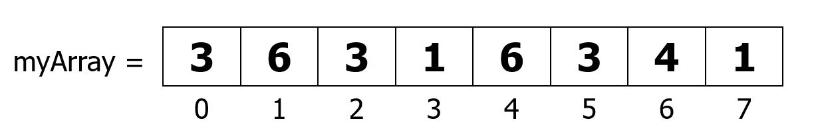

# Contents:
* [Declaration](#declaration)
* [Assignment](#assignment)
* [Relational Operators](#relational_operators)
* [Statements and Blocks](#statements_and_blocks)
* [Flow of Control](#flow_of_control)
* [If – The Conditional Statement](#if-the_conditional_statement)
* [If… else](#if-else)
* [Nested if … else](#nested_if-else)
* [else if](#else_if)
* [The switch Statement](#the_switch_statement)
* [For Loops](#for_loops)
* [While Loops](#while_loops)
* [Do {...} While Loops](#do_while_loops)
* [Break](#break)
* [Continue](#continue)
* [Arrays](#arrays)

# Declaration:
<a name='decalaration'></a>

```java
int index = 1.2; 		// compiler error
boolean retOk = 1;		// compiler error
double fiveFourths = 5 / 4;   // no error!
float ratio = 5.8f;		// correct
double fiveFourths = 5.0 / 4.0;	// correct
```  
* 1.2f is a float value accurate to 7 decimal places.
* 1.2 is a double value accurate to 15 decimal places.

# Assignments:
<a name='assignments'></a>

All Java assignments are right associative
```java
int a = 1, b = 2, c = 5;
a = b = c;
System.out.print("a= " + a + "\tb= " + b + "\tc= " + c);
// Output: a= 5 b=5 c=5
```
Done right to left: `a = (b = c);` will yield the same result.

# Relational Operators:
<a name='relational_operators'></a>

Operator | Funtion
--- | ---
== | Equal (careful)
!= | Not equal
\>= | Greater than or equal
<= | Less than or equal
\> | Greater than
< | Less than

# Statements and Blocks:
<a name='statement_and_blocks'></a>

A simple statement is a command terminated by a semi-colon:
`name = “Fred”;`
A block is a compound statement enclosed in curly brackets:
```java
{
    name1 = “Fred”; name2 = “Bill”;
}
```
Blocks may contain other blocks

# Flow of Control:
<a name='flow_of_control'></a>

Java executes one statement after the other in the order they are written  
Many Java statements are flow control statements:  
__Alternation:__ if, if else, switch  
__Looping:__ for, while, do while  
__Escapes:__ break, continue, return  

# If – The Conditional Statement:
<a namw='if-the_conditional_statement'></a>

The if statement evaluates an expression and if that evaluation is true then the specified action is taken  
`if ( x < 10 ) x = 10;`  
If the value of x is less than 10, make x equal to 10  

It could have been written:
```java
if ( x < 10 )
x = 10;
// Or, alternatively:
if ( x < 10 ) { x = 10; }
```
# If… else:
<a name='if-else'></a>

The if … else statement evaluates an expression and performs one action if that evaluation is true or a different action if it is false.
```java
if (x != oldx) {
	System.out.print(“x was changed”);
}
else {
	System.out.print(“x is unchanged”);
}
```

# Nested if … else:
<a name='nested_if-else'></a>

```java
if ( myVal > 100 ) {
	if ( remainderOn == true) {
		  myVal = mVal % 100;
	}
	else {
		myVal = myVal / 100.0;
	}
}
else
{
	System.out.print(“myVal is in range”);
}
```

# else if:
<a name='else_if'></a>

Useful for choosing between alternatives:
```java
if ( n == 1 ) {
	// execute code block #1
}
else if ( n == 2 ) {
	// execute code block #2
}
else {
	// if all previous tests have failed, execute code block #3
}
```

# The switch Statement:
<a name='the_switch_statement'></a>

```java
switch ( n ) {
	case 1: 
		// execute code block #1
		break;
	case 2:
		// execute code block #2
		break;
		default:
		// if all previous tests fail then        	//execute code block #4
		break;
}
```

# For Loops:
<a name='for_loops'></a>

* Loop n times:
```java
for ( i = 0; i < n; n++ ) {
	// this code body will execute n times
	// ifrom  0 to n-1
}
```
* Nested for:
```java
for ( j = 0; j < 10; j++ ) {
	for ( i = 0; i < 20; i++ ){
		// this code body will execute 200 times
	}
}
```
* Minimum times the loop is executed: 0  
* Maximum times the loop is executed: n

# While loops:
<a name='while_loops'></a>

```java
while(response == 1) {
	System.out.print( “ID =” + userID[n]);
	n++;
	response = readInt( “Enter “);
}
```
* Minimum times the loop is executed: 0  
* Maximum times the loop is executed: infinite

# do {… } while loops:
<a name='do_while_loops'></a>

```java
do {
	System.out.print( “ID =” + userID[n] );
	n++;
	response = readInt( “Enter ” );
}while (response == 1);
```
* Minimum times the loop is executed: 1  
* Maximum times the loop is executed: infinite 

# Break:
<a name='break'></a>

A break statement causes an  exit from the _innermost_ containing _while, do, for_ or _switch_ statement.
```java
for ( int i = 0; i < maxID, i++ ) {
	if ( userID[i] == targetID ) {
		index = i;
		break;
	}
}	// program jumps here after break 
```

# Continue:
<a name='continue'></a>

* Can only be used with while, do or for.  
* The continue statement causes the innermost loop to start the next iteration immediately
```java
for ( int i = 0; i < maxID; i++ ) {
	if ( userID[i] != -1 ) continue;
	System.out.print( “UserID ” + i + “ :” +   		userID);
}
```

# Arrays:
<a name='arrays'></a>

* An array is a list of similar things.  
* An array has a fixed:  
    - name
    - type
    - length
* These must be declared when the array is created.
* Arrays sizes cannot be changed during the execution of the code.  
  
* myArray has room for 8 elements & the elements are accessed by their index.  
* In Java, array indices start at 0  

## Declaring Arrays:
`Int[] myArray OR int myArray[];` -> Declares myArray to be an array of integers  
`myArray = new int[8];` -> sets up 8 integer-sized spaces in memory, labelled myArray[0] to myArray[7]  
`int myArray[] = new int[8];` -> combines the two statements in one line  

## Assigning Values:
* Refer to the array elements by index to store values in them.
```java
myArray[0] = 3;
myArray[1] = 6;
myArray[2] = 3;   ...
```
* We can create and initialise in one step:
```java
int myArray[] = {3, 6, 3, 1, 6, 3, 4, 1};
```

## Iterating Through Arrays:
for loops are useful when dealing with arrays:
```java
for (int i = 0; i < myArray.length; i++) {
  myArray[i] = getsomevalue();
}
```

## Arrays of Objects:

- So far we have looked at an array of primitive types.
    - integers
    - could also use doubles, floats, characters…
- Often want to have an array of objects
    - Students, Books, Loans ……
- Need to follow 3 steps.

## Declaring the Array:

1. Declare the array  
```java 
private Student studentList[];  
```
This declares studentList   

2. Create the array
```java
studentList = new Student[10];  
```
This sets up 10 spaces in memory that can hold references to Student objects

3. Create Student objects and add them to the array:  
```java
studentList[0] = new Student("Cathy", "Computing");
```

