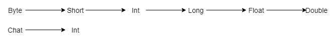
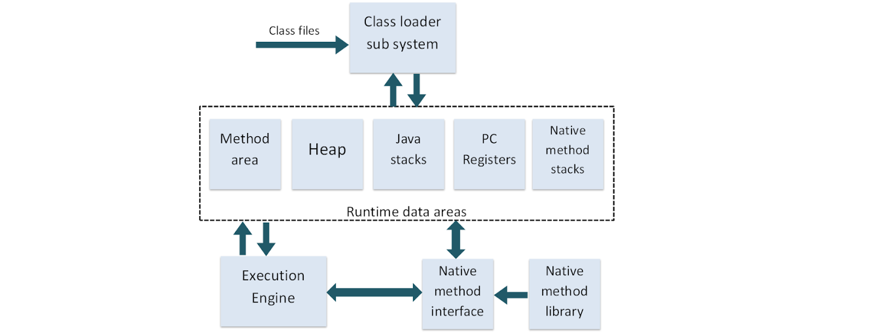
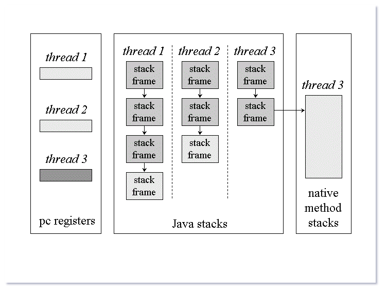
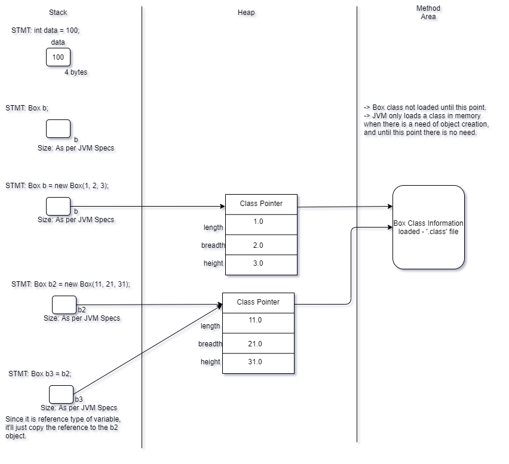
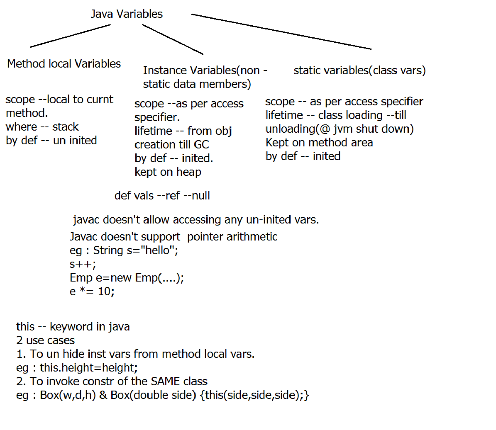

# Contents: 
* [Rules for naming an identifier](#rules_for_naming_an_identifier)
* [Conversion in Primitive Data Types](#conversion_in_primitive_data_types)
* [JVM Data Areas](#jvm_data_areas)
* [Object Oriented Principles](#object_oriented_principles)
* [Regarding Garbage Collection](#regerding_garbage_collection)
* [Pointers vs Java References](#pointers_vs_java_references)
* [Different types of Variables](#different_types_of_variables)

<hr>

# Rules for naming an identifier:
<a name='rules_for_naming_an_identifier'></a>

* All variable names must begin with a letter of the alphabet, an underscore ( _ ), or a dollar sign ($).  
* Can't begin with a digit.  The rest of the characters may be any of those previously mentioned plus the digits 0-9.  
* Can't use a keyword as an identifier.
* The convention is to always use a lower case letter of the alphabet as the first letter and then camel casing. 
* The dollar sign and the underscore are discouraged.

# Conversion in Primitive Data Types:
<a name='conversion_in_primitive_data_types'></a>
There are two types of conversion:
1. Automatic conversion/Widening/Type Promotion/Implicit.(performed by Compiler)
2. Downcasting/Narrowing/Explicit.(performed by user)

Examples:
When we convert a byte type of data to short, it is automatically done, as short has a higher bucket size, and thus compiler can easily convert it, without altering it's value.
```java
byte b = 10;
short s = b;
```
The above piece of code won't give an error, as byte can be automatically converted into short. But not the other way around.

The whole cycle of automatic conversion is:  


The Java Compiler has to follow certain rules when doing automatic conversions:  
    * The source type and the destination types must be compatible.  
    * The destination type must be larger and thus should be able to hold larger value.  

Long to float is also considered as an automatic conversion, even if long is 8 bytes and float is 4 bytes in size. This is because float allows you to store larger values with a loss of some precision.

__NOTE:__ In Java most optimized data type is considered as int, because of the word size of the operating system, and the number of bytes a computer can read at the same time. So any operation which involves _byte_ or _short_ type of data will automatically be promoted to int and then carried out.

Narrowing conversion/forced conversion(type-casting):   
    double ---> int  
    float --> long  
    double ---> float  

How it's done:
```java
double a = 5.6;
int x = (int)a;
```

__NOTE:__ 
* Java Compiler(javac) doesn't allow accessing any un-initialized variable. Any method local variables that are allocated on stack are uninitialized by default(hold garbage value) and thus if we have n't assigned a value to it, it'll give a compiler error.  
* In Java, an if condition requires a boolean expression, anything other than that won't work- 0 or 1 like in C/C++.
* When storing data into a variable, if we give data more than it's size, it gives an error that we're trying to convert a higher data type to a lower data type. Example:
```java
byte b = 12222;
```
```console
$ javac test.java
test.java:3: error: incompatible types: possible lossy conversion from int to byte
                byte b = 12222;
                         ^
1 error
```
* Compiler cannot find out what the value will be after the execution/runtime. So, the below code doesn't give an error:
```java
byte b1 = 127;
byte b2 = b1++;
```
This does n't give an error and stores the information. The value stored in b1 and b2 is 127 and then the value in b1 is updated to -128.
* When using short hand notation, it'll automatically do the explicit type-casting. Example:
```java
byte a = 1, b = 2;
a = a + b;  // Compiler error
a += b;     // No compiler error
```

__NOTE:__ 
    
    c, c++,java are statically typed languages where data type is already known at compile time.
    Once a variable is declared to be of a certain data type, it cannot hold values of other data types.
    Dynamically typed languages -> javascript,  Ruby, Python

    Java is  strongly-typed programming language.
    primitive data types (such as integer, character, etc.) are predefined as part of the language and 
    all constants or variables defined  must be described with one of the data types (no type inferencing is supported)

    Meaning of type inferencing:Like in JavaScript there is no need to declare a varible as some type, it is already inferred what the data type of the Variable would be.
    Ex: var x=5;(Here x is already inferred as to of int type)

__NOTE:__

    Java is not truely object oriented b'coz there are a few object-oriented priciples that it doesn't support.
    For ex:Multiple Inheritence,Operator Overloading,Not everything here is an object.
    Java also supports functional programming paradigm.

# JVM Data Areas:
<a name='jvm_data_areas'></a>

For this, let's look at the JVM architecture again:


When we run a java program, we start the JVM(using `java` command) that is a process on the Operating System. The operating system allocates some memory to the JVM and this memory will be divided into different parts for different purposes.  

## Method Area: 
* The 'Class Loader Subsystem' will load/store the class information into the method area.Thus, __method area is used to store class specific information__. 
* Java 8 onwards the name of the method area is called __Metaspace__. Till Java 7 it was called __Permanent Generation Space(PermGen Space)__.  
* The _PermGen Space_(mehtod area till java 7) was fixed in size and when we kept on adding classes to the program, it gave us Out of Memory errors.  
* MetaSpace is allocated memory from the native memory of the computer and it is not on the Vitual Memory which has a fixed size. So theoritically, this won't go Out of Memory.
* One Method Area per JVM- One method area will be shared accross multiple threads belonging to the same JVM isntance.

## Object Heap:
* In Java, there is no concept of Local Object. All the objects are created dynamically using 'new' keyword and thus the objects are stored in the Object Heap.
* Object has a state and a behavior. State of an object are the non-static data members. And behavior of the object is the functions that the object can be performed upon. 
* Object Heap will only save the state of the object. The behaviour of the object is stored in the mehtod area with the class information.
* One Object Heap per JVM- One Object Heap will be shared accross multiple threads belonging to the same JVM instance.

## Java Stacks:
* One stack per thread.  
  
* Stack will hold method arguments, method local variables and the return types.
* Each stack consists of different stack frames which are different function calls.
* Whenever a new function is called, it's stack frame is created and in this stack frame, all method local data is stored.

## PC Registers: 
* This will store the address of the next line of code to execute.
* This will be one per thread.

## Java Native Stacks:
* Java provides us with a Java Native Interface(JNI) using which we can call a C/C++/Assembly method from a java program. 
* All method local runtime information of the native methods are stored in Native Method Stack.
* One Per thread.

# Object Oriented Principles:
<a name='object_oriented_principles'></a>

Classes and Objects are basic concepts of Object Oriented Programming which revolve around the real life entities.

## Class:
A class is a user defined blueprint or prototype from which objects are created. It represents the set of properties or methods that are common to all objects of one type. 

Class declaration includes:  
1. Access specifiers  : A class can be public or has default access 
2. Class name: The name should begin with a capital  letter & then follow camel case convention
3. Superclass(if any): The name of the class’s parent (superclass), if any, preceded by the keyword 'extends'.(Implicit super class of all java classes is java.lang.Object)
4. Interfaces(if any): A comma-separated list of interfaces implemented by the class, if  any, preceded by the keyword 'implements'. A class can implement more than one interface.
5. Body: The class body surrounded by braces, { }.
6. Constructors: Constructors are used for initializing new objects. Constructor is a special method having same name as the class name with no explicit return type. Implicity it returns the type of the class itself. It can may be parameterized or parameter less.
7. Fields are variables that provides the state of the class and its objects. Example: name of the Employee class
8. Methods are used to implement the behavior of the class and its objects.

eg : Student,Employee,Flight,PurchaseOrder, Shape ,BankAccount

__NOTE:__
* Parameterized constructor is used to initialize state of the object.
* If a class does not explicitly declare any constructor , the Java compiler automatically provides a no-argument constructor,called the default constructor. 
* This default constructor implicitely calls the super class's  no-argument constructor.

## Object:
It is a basic unit of Object Oriented Programming and represents the real life entities.  A typical Java program creates many objects, which  interact by invoking methods.

An object consists of :
1. State : It is represented by attributes of an object. (properties of an object)
2. Behavior : It is represented by methods of an object (actions upon data)
3. Identity : It gives a unique identity to an object and enables one object to interact with other objects. eg : Emp id / Student PRN / Invoice No 

### Creating an object:
* The 'new' operator instantiates a class by allocating memory for a new object and returning a reference to that memory.   
* It returns the class type reference to the object.  
* The 'new' operator also invokes the class constructor.
* The values set by default to the instance variables are the default values. Like, 0 for int, and 0.0 for double. null for reference type variable.

## Encapsulation:
* Encapsulation is defined as the wrapping up of data & code under a single unit. --consists of Data hiding & Abstraction.  
* It is the mechanism that binds together code and the data it manipulates.  
* It is a protective shield that prevents the data from being accessed by the code outside this shield.  
* The variables or data of a class is hidden from any other class and can be accessed only through any member function/method of own class in which they are declared.  
* As in encapsulation, the data in a class is hidden from other classes, so it is also known as data-hiding.  
* Tight Encapsulation can be achieved by: Declaring all the variables in the class as private and writing public methods as its accessors.

eg : Create tightly encapsulated Box class , supply public accessors. 

### Advantages of Encapsulation:
1. Data Hiding (security)  
2. Increased Flexibility: We can make the variables of the class as read-only or write only or r/w.  
3. Reusability: Encapsulation also improves the re-usability and easy to change with new requirements.  
4. Testing code is easy  

__NOTE:__ Abstraction -- achieved by supplying an interface to the Client (customer) .Highlighting only WHAT is to be done & not highlighting HOW it's internally implemented.

Implementation example:  
[Box.java](../code_files/day2/classwork/src/Box.java)  
[TestBox.java](../code_files/day2/classwork/src/TestBox.java)  

__NOTE:__ Looking at the Box.java file, when we use the same variable names for the local scope in the constructor/method and the instance variable. That is called shadowing. That's the reason, we have to use `this` keyword when working with instnace variables in the same scope with local variables with same variable names.

__NOTE:__ The different types of object relationships are:  
1. 'is a': Inheriting the properties of a class and extending it. Example: Mango & Fruit- Mango is a fruit.
2. 'has a': Containment. One object contains a reference to another object. Example: The user object may have another object reference to address object.
3. 'uses a': In the above program, the TestBox class uses a Box class. It is dependent on the Box class. This is different from the 'has a' relationship because 'has a' means that the reference object is a part of the object in question. But when we have 'uses a', it means it is just dependent on a different variable.

## Memory Allocation Diagram:


From the above picture, if we execute a statement as `b = null`, the link to the first object is cut and thus it'll have no references pointing to it. That object will be marked for Garbage Collection. Garbage => Unreachable object in java.

__NOTE:__ One trigger for class loading is instantiating a class. Class loading happens only once per jvm. If an object of the same class is needed to be created, since the class is already loaded, JVM will use the already loaded class.

# Regarding Garbage Collection:
<a name='regerding_garbage_collection'></a>

* Garbage in Java => un-referencable object.
* Automatic Gargabe Collection --- to avoid Memory leaks/holes.
* JVM creates 2 thrds --- main thrd(to exec main() sequentially) -- foreground thrd G.C --- daemon thrd ---background thrd --- JVM activates it periodically(only if required)  --- GC releases the memory occupied by un-referenced objects allocated on the heap(the obj whose no. of ref=0) 
* Request for GC => API of System class: `public static void gc()`. So to call it: `System.gc();` Internally it will call : `Runtime.getRuntime().gc();`.
* Releasing of  non- Java resources.(eg - closing of DB connection, closing file handles,closing socket connections) is NOT done automatically by GC.
* Object class API `protected void finalize() throws Throwable` is automatically called by the garbage collector on an object before garbage collection of the object takes place.
## Triggers for marking the object for GC(candidate for GC):

1. Nullifying all valid refs.
2. re-assigning the reference to another object
3. Object created within a method & its ref NOT returned to the caller.

# Pointers vs Java References:
<a name='pointers_vs_java_references'></a>

Similarity -- Pointer & reference --hold an address to the object created on heap.
Difference -- To add robustness to the language pointer arithmatic is not allowed in java.

reference --- holds internal representation of address --

# Different types of Variables:
<a name='different_types_of_variables'></a>


