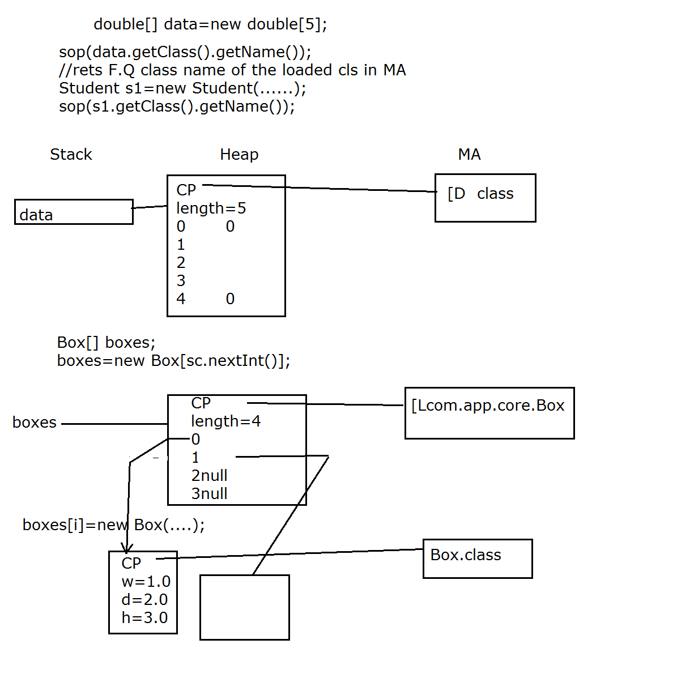

# Contents:
* [Java Arrays](#java_arrays)
* [Access Specifiers](#access_specifiers)
* [Inheritence](#inheritence)


# Java Arrays:
<a name='java_arrays'></a>

- Arrays are a list of homogenous elements with fixed lenth.
- Java Arrays are always created as an Object. Thus the array whether be it primitive type array or a reference type array object, it's memory will be allocated on Heap.  
- Java Arrays are Immutable in nature, i.e., array sizes cannot be modified.
- Even though arrays are immutable, but the reference to those array objects are not. So, we can reasign the array reference with a different array altogether of the same type.  
- The things need to create an array are the name, type and the length. Without any of these three items, we cannot create an array.  
- Arrays have a data member callecd `length`, so we don't have to call a function to find out the length of the array.
- For-each method to iterate over each element in java:
```java
for (double d: array) {
    System.out.println(d);
}
```
- For-each loop always move in the forward direction with a step count of 1.

__NOTE:__ For-each loop always works on a copy. So it copies the variable into a local stack variable, and does operation on it. And thus for-each cannot be ever used to populate the contents of an array.  
- Array object is created by JVM, so there is no specific array class that is loaded in Method Area. But depending on the array, we can deduce what will be the name of the class loaded in Method Area.  
- For a single dimensional array object of integer type, the class loaded in JVM Method Area is: `[I`.  
- For double, it is: `[D`.  
- For a multi-dimensional array of integer type, the class loaded will look like: `[[I`, and so on it goes.
- For a use-defined reference type array, the object created is: `[Lcom.app.core.Box`. L here means that this is not a primitive type rather an array of refernce.  

__NOTE:__ To test this out, you can try running this command:
```java
Box[] arr = new Box[5];
System.out.println(arr.getClass().getName());
// Output: [Lcom.app.core.Box
```
The getclass() is a function of the `java.lang.Object` class, which returns a Class(`java.lang.Class`) type of reference. This 'Class' class in the java.lang package contains a bunch of different functions which can get us a lot of the information about the class from it's reference. `getName()` is one such function which returns the fully qualified class name of the reference it is given.

- Example of usage of primitive array:  
[TestPrimArray.java](../code_files/day3/classwork/src/com/app/tester/TestPrimArray.java)  

- Example of usage of reference type array:  
[Box.java](../code_files/day3/classwork/src/com/app/core/Box.java)  
[TestRefArray.java](../code_files/day3/classwork/src/com/app/tester/TestRefArray.java)  

## Memory picture of Arrays:


# Access Specifiers:
<a name='access_specifiers'></a>

Access Modifiers and their access in different places:
| Modifier | Same Class | Same Package sub-class | Same package non sub-class | Different package sub-class | Different package non sub-class |
| --- | --- | --- | --- | --- | --- |
| Private | Yes | No | No | No | No |
| Default | Yes | Yes | Yes | No | No |
| Protected | Yes | Yes | Yes | Yes | No |
| Public | Yes | Yes | Yes | Yes | Yes |

__NOTE:__ In java protected members work as default while accessing them in the same package.

# Inheritence
<a name='inheritence'></a>

- In OOP, we often organize classes in hierarchy to avoid duplication and reduce redundancy.  
- The classes in the lower hierarchy inherit all the variables (attributes) and methods (dynamic behaviors) from the higher hierarchies.  
- A class in the lower hierarchy is called a subclass (or derived, child, extended class).  
- A class in the upper hierarchy is called a superclass (or base, parent class).  
- By pulling out all the common variables and methods into the superclasses, and leave the specialized variables and methods in the subclasses, redundancy can be greatly reduced or eliminated as these common variables and methods do not need to be repeated in all the subclasses. Re usability is maximum.  
- A subclass inherits all the member variables and methods from its superclasses (the immediate parent and all its ancestors). It can use the inherited methods and variables as they are. It may also override an inherited method by providing its own version, or hide an inherited variable by defining a variable of the same name.  
- __Summary:__ Sub class 'IS-A' super class , and something more (additional state + additional methods) and something modified(behaviour --- method overriding)

Example: 

    Person -- firstName,lastName
    Student --firstName,lastName,grad year
    Faculty -- firstName,lastName,yrs of experience , SME
    OR
    Emp-Mgr-SalesMgr scenario.
    OR
    Fruit -- Apple -- FujiApple

- A subclass inherits all the variables and methods from its superclasses, including its immediate parent as well as all the ancestors.  
- It is important to note that a subclass is not a "subset" of a superclass. In contrast, subclass is a "superset" of a superclass. It is because a subclass inherits all the variables and methods of the superclass; in addition, it extends the superclass by providing more variables and methods.  
- __Keyword:__ `extends`  
- Java does n't give us the option to inherit the class in private/public mode. All java has is public type inheritence, so it inherits the data members in the access specification they are in, and does n't change that like when using private inheritence in C++.  

## Types of inheritance 
1. Single inheritance:

    class A{...} class B extends A{...}

2. Multi level inhertance 
    
    class A{...} class B extends A{...} class C extends B{...}

3. Multiple inhertiance --- NOT supported

    class A extends B,C{...}  -- compiler err  
    Reason: For simplicity(Diamond problem).  
    Example: We have two classes B and C inheriting from A. Assume that B and C are overriding an inherited method and they provide their own implementation. Now D inherits from both B and C doing multiple inheritance. D should inherit that overridden method. BUT which overridden method will be used? Will it be from B or C? Here we have an ambiguity. This is fixed by Java.  

## Constructor Invocation for Inheritence:

In the constructor call, the first statement will always be to the immediate super class's constructor. If not defined explicitly, it'll call the parameterless constructor of the immediate super class implicitly. Example:
```java
class A {
    A() {
        // super(); -> Implicit call to immediate super class's parameterless constructor -> java.lang.Object class
        System.out.println("1");
    }
}
class B extends A {
    B() {
        // super(); -> Implicit call to immediate super class's parameterless constructor -> A class
        System.out.println("2");
    }
}
class C extends B {
    C() {
        // super(); -> Implicit call to immediate super class's parameterless constructor -> B class
        System.out.println("3");
    }
}
class Tester {
    public static void main(String[] args) {
        C c = new C();
    }
}
```
```output
Output:
1
2
3
```
__NOTE:__  
* In case of implicit call of `super()` to the super class' constructor, it calls to the parameterless constructor.
* If there is not parameterless constructor, it'll return an error, because when we write a parameterised constructor, Java won't produce a default parameterless constructor automatically.
* The keyword `this` refers to the current class, and the keyword `super` refers to the immediate super class.  
* Unless and until the super class is not loaded into the memory, an object cannot be created.  

## Inheritance Example:
- Super Class: [Person.java](../code_files/day3/classwork/src/com/app/core/Person.java)  
- Student Class: [Student.java](../code_files/day3/classwork/src/com/app/core/Student.java)  
- Testing Class: [TestIng.java](../code_files/day3/classwork/src/com/app/tester/TestInh.java)  

## Using toString() method:
1. The overloaded print function of the PrintStream class is called: `public void print(Object obj)/public void println(Object obj)`.  
2. Generates the String representation of the Object using the method `String.valueOf(Object)` and is translated into bytes according to the platform's default character encoding, and these bytes are written in exactly the manner of the `write(int)` method.
3. The method `String.valueOf(Object)` returns the string representation of the Object argument - `null` if the value of the reference is null , otherwise, the value of `obj.toString()` is returned. This is the reason, if we try to print/call implicit toString() function on a reference which is null, it does n't give a NullPointerException. But rather it prints out 'null'.   
4. Default return type of  `toString()`:
    Fully Qualified Class name @ hashcode  
    hashcode= internal representation of adr.  
```java
getClass().getName() + '@' + Integer.toHexString(hashCode())
```
5. To display our object in a more contextual manner, we have to override the `toString()` method in our own class, which will return the String representation of the object- contents of the object. So, when we print the object using println() method, what will happen is:
```java
Student s = new Student("Umang", "Sharma", 2017);
System.out.println(s);

//-> The above statement calls String.valueOf(s)
//-> This will call the s.toString() in Student
//-> So, there needs to be an toString() overridden in Student class.

//Student:
public String toString() {
    return "First Name: " + firstName + "\nLast Name: " + lastName + "\nGraduation Year: " + gradYear;
}

//If Student was a subclass of Person class:
//Person
public String toString() {
    return "First Name: " + firstName + "\nLast Name: " + lastName;
}
//Student
public String toString() {
    return super.toString() + "\nGraduation Year: " + gradYear; //Had to call super.toString() as gradYear is the only available variable available in this scope
}
```

The types of methods that cannot be overridden:
- private methods: This cannot be overridden as it is not being inherrited and thus cannot be overridden.
- static: There is only a single copy accross the class, so this cannot be overridden.
- final keyword added methods: This keyword was introduced to stop method overriding.

__NOTE:__ If a method is not present is the class we're calling it on, it'll go look for it in it's immediate super class.