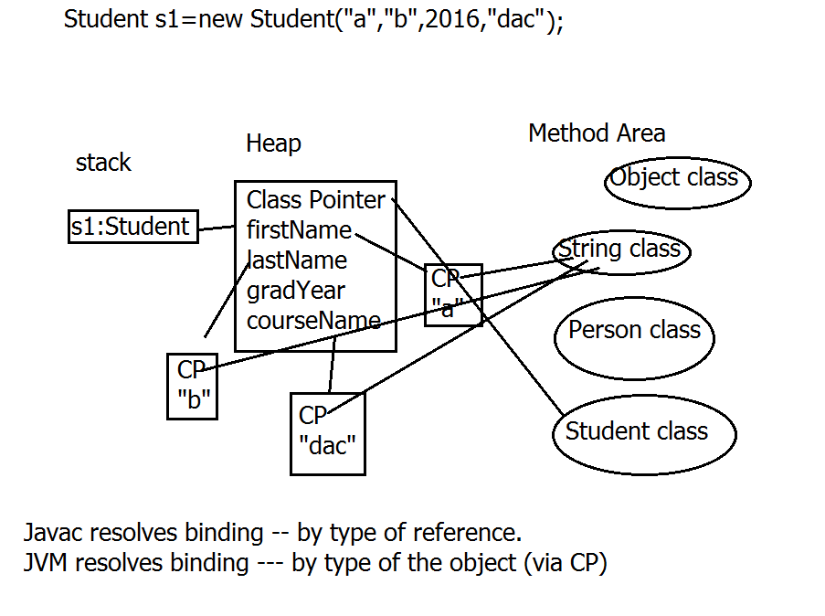
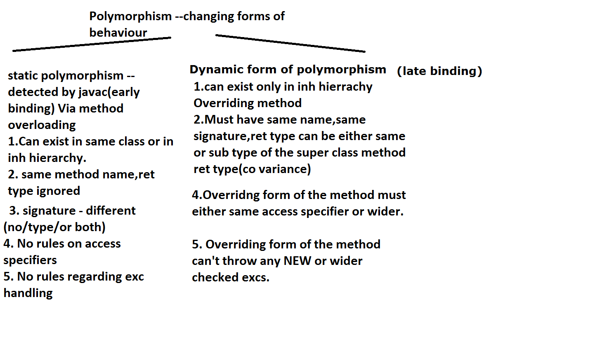

# Contents:
* [Memory Picture of Student Object](#memory_picture_of_student_object)
* [Polymorphism](#polymorphism)

# Memory Picture of Student Object
<a name='memory_picture_of_student_object'></a>



# Polymorphism
<a name='polymorphism'></a>
Polymorphism allows us to perform a single action in different ways. In other words, polymorphism allows you to define one interface and have multiple implementations. The word “poly” means many and “morphs” means forms, So it means many forms.  
In Java polymorphism is mainly divided into two types:  
1. Compile time Polymorphism.
2. Runtime Polymorphism


## 1. Compile time Polymorphism: 
Static/ early binding ---resolved by javac. Achieved via method overloading.  

_Rules:_ can be in same class or in sub classes.  
Same method name  
_Signature:_ Different (number of arguments/type of arguments/both)  
_Return type:_ Ignored by compiler.  

```java
void test(int i,int j){...}
void test(int i) {..}
void test(double i){..}
void test(int i,double j,boolean flag){..}
int test(int a,int b){...}   //---> compiler err. as this will be the same as the first one
```
__RULE:__ When javac doesn't find exact match --tries to resolve it by the closest arg type(just wider than the specified arg)

Example:  
`void test(int i, int j){}` and the call is: `test(short, short)`. This will work fine as if the compiler not able to find the exact list of arguments, it'll call the method.  

## 2. Runtime Polymorphism:
Dynamic polymorphism --- late binding --- Dynamic Method Dispatch ---resolved by JRE.

_Dynamic method Dispatch_ -- which form of method to send for execution ---This decision can't be taken by javac --- BUT taken by JRE. Achieved via -- method overriding.  
NO "virtual" keyword in java.  
All java methods can be overridden, if they are not marked as private,static,final.  
Super-class form of method - --- overridden method  
sub-class form --- overriding form of the method  

### Rules to be followed by overriding method in a sub-class:
1. same method name, same signature, ret type must be same or its sub-type(co-variance)
    eg of co-variance

    ```java 
    class A {
        A getInstance()
        {
            return new A();
        }
    }

    class B extends A
    {
        B getInstance()
        {
            return new B();
        }
    }
    ```

2. Access Specifier/Scope --must be same or wider.

3. Will be discussed in exeception handling.
    Can not add in its throws clause any new or broader checked exceptions.
    BUT can add any new unchecked excs.
    Can add any subset or sub-class of checked excs.
    ```java
    class A
    {
        void show() throws IOExc {...}
    }
    class B extends A
    {
        void show() throws Exc {...}
    }
    ```
    Can't add super class of the checked excs.

__NOTE:__
From JDK 1.5 onwards : Annoations are available --- metadata meant for Compiler or JRE.(Java tools)  
Java Annotation is a tag that represents the metadata i.e. attached with class, interface, methods or fields to indicate some additional information which can be used by java compiler and JVM.  
Annotations in java are used to provide additional information to the java compiler, so it is an alternative option for XML.  
ex: `@Override, @Deprecated, @SuppressWarnings, @FunctionalInterface`  
`@Override`: Annotation for javac. While overridng the method --- if u want to inform the compiler that following is the overriding form of the method use:  
```java
@Override
<method defination>

//or
@Override
int test(int a, int b) {}
```
Annotations can be of:  
- Class level(before the class defination)  
- Field level(before the field defination)  
- Method level(before the method defination)  

### Run time polymorphism or Dynamic method dispatch in detail:
Super-class ref. can directly refer to sub-class object(direct=w/o type casting) as its the example of up-casting(similar to widening auto. conversion). When such a super class ref is used to invoke the overriding method: which form of the method to send for execution : this decision is taken by JRE & not by compiler. In such case, overriding form of the method(sub-class version) will be dispatched for exec.  
Super-class ref. can directly refer to sub-class inst BUT it can only access the members declared in super-class, directly.  

Example:
```java
A ref=new B(); 
ref.show()  // ---> this will invoke the sub-class: overriding form of the show() method
```
__NOTE:__ Java Compiler always goes by the type of reference to deduce any syntactical errors. JVM always goes by the type of the object it is performing operation on, to deceide which class's method to be called. This is called Runtime Polymorphism. In java, it is called as Dynamic Method Dispatch.

## Overloading vs Overriding:


## Applying inheritance & polymorphism 
`java.lang.Object` --- Universal super class of all java classes including arrays.


__Object class method__:  
`public String toString()` ---Rets string representation of object.  
_Internally calls:_ `obj.getClass().getName()+"@"+Integer.toHexString(obj.hashcode());` [obj being the name of the object to be printed]  
_Returns:_ Fully qualified class Name @ hash code  
_hash code:_ Internal memory representation.(hash code is mainly used in hashing based data structures -- will be done in Collection framework)  

__Why override toString?__  
To replace hash code version by actual details of any object.  

eg -- Use it in  sub classes. (override toString to display Account or Point2D or Emp details)  

__NOTE:__ When the type of the object and the reference are the same, it is called __Direct Referencing__.  Sub-class reference pointing to sub-class object.  

__NOTE:__ A reference of a super class can point to the object of the sub-class.  
Example:  
```java
class Emp {...}
class Mgr extends Emp {...}

psvm(S[] a) {
    Emp ref = new Mgr();    //Completely legal due to Upcasting.
    SOP(ref);   // Compiler does n't find an error here, because all the compiler is looking for is the toString() method to be present in Emp class. If it is not present in Emp class, it'll look for toString() in it's super class.
}
```
In the above case, this is possible because the Mgr object is upcasted to the super-class type(Emp class type). Upcasting conversion is done automatically(implicitly).  

## Upcasting in Java:
The most important aspect of inheritance is not that it provides methods for the new class.  
It's the relationship expressed between the new class and the base class. This relationship can be summarized by saying "The new class "IS a" type of the existing class."  
eg : Student is of Person type or Faculty is of Person type  
  
This description is not just a fanciful way of explaining inheritance,it's supported directly by 
the language.  
  
As an example, consider a base class called Instrument that represents musical instruments, and a derived class called Guitar. Because inheritance means that all of the methods in the base class are also available in the derived class, any message you can send to the base class can also be sent to the derived class. If the Instrument class has a play( ) method, so will Guitar. This means we can accurately say that a Guitar object is also a type of Instrument.

## Downcasting in Java:
This is not done implicitly in Java and has to be done manually, because the compiler/JVM won't know which sub-class to cast the object to as one class can be extended by many sub-classes. To do this:
```java
for (Employee e: emp) {
    if(e instanceof Manager) {
        Manager m = (Manager)e;
        System.out.println("The performance bonus: " + m.getPerfBonus());
            //this would be a compiler error is not downcased as this function is not present in Employee function.
    }
}
```
__NOTE:__ If a Manager type of object is being cast to Worker type of object, it'll give an Exception `IllegalCastingException`. The compiler won't give any error, as it'll check if the Employee and Worker classes are related or not, and it'll allow. 
```bash
Exception in thread "main" java.lang.ClassCastException: com.app.core.Worker cannot be cast to com.app.core.Manager
        at com.app.tester.Tester.main(Tester.java:47)
```
In order to avoid this issue, there are two ways:
- Using `instanceof` operator to check the type of the object and then casting the object.
- Using Run-time type information in the reflection class programming(At the end of the course).

__NOTE:__ `instanceof` operator is used to check if the object the reference is pointing to is of the class it's being checked upon. Used for testing run time type information.
Example:
```java
Emp e =new Mgr(...);
if (e instanceof Mgr) //rets true if e --->Mgr obj
if (e instanceof Worker) //rets true if e --->Worker obj
if (e instanceof Emp)  //rets false.
```

## Examples of Method Overriding/Inheritence-Polymorphism:
### Core classes:
- [Employee.java](../code_files/day4/classwork/src/com/app/core/Employee.java)  
- [Manager.java](../code_files/day4/classwork/src/com/app/core/Manager.java) extending [Employee](../code_files/day4/classwork/src/com/app/core/Employee.java) Class  
- [Worker.java](../code_files/day4/classwork/src/com/app/core/Worker.java) extending [Employee](../code_files/day4/classwork/src/com/app/core/Employee.java) Class  

### Tester class of these core classes:
[Tester.java](../code_files/day4/classwork/src/app/tester/Tester.java)

__NOTE:__ API of `java.util.Arrays` class `public static String deepToString(Object[] a)`. __INPUT:__ A - the array whose string representation to return. __RETURN:__ a string representation of A.

## Use of 'abstract' Keyword:
* `abstract` keyword is used in java to let the inheriting classes know that the method defined as abstract has to be overridden.
* `abstract` : keyword in Java  
* This concept is directly linked to Abstraction. If you want to hide the actual implementaion details to the actual sub-types, but on the other hand you want the same declaration to be followed by the actual sub-classes.
* abstract methods ---methods only with declaration & no definition  
    ex: `public abstract double calNetsalry();`  

* Any time a class has one or multilple abstract methods ---- class must be declared as abstract class.  
    ex: `public abstract class Emp {....}`  

* Abstract classes can't be instantiated BUT can create the ref. of abstract class type to refer to concrete sub-class instances.  
    ```java
    Emp e1=new Emp(...);    //illegal
    Emp e1=new Mgr(....);   //legal
    ```
* Abstract classes CAN HAVE concrete(non-abstract) methods.  
* Abstract classes MUST provide constructor/s to init its own private data members.  
* An abstract class be crerated with 100% concrete functionality as well.

## Usage of 'final' keyword:
* `final` keyword in java is to let JVM/users to know that the method won't be able to be overridden any more.  
* Can a class be decalred as abstract & final? NO   
__Usage:__   
1 final data member(primitive types) - constant.
    Ex: `public final int data=123;`

2. final methods ---can't be overridden.
    usage eg `public final void show{.....}`
    eg -- Object class -- `wait`, `notify`, `notifyAll`

3. final class --- can't be sub-classed(or extended) -- i.e stopping inheritance hierarchy.
    eg -- String ,StringBuffer,StringBuilder

4. final reference -- references can't be re-assigned.
    ```java
    final Emp e=new Mgr(.......);
    e=new Worker(.....);    //compiler err
    ```

__Special note on  protected:__   
Protected members acts as default scope within the same package. BUT outside pkg -- a sub-class can access it through inheritance(i.e just inherits it directly) & CANT be accessed by creating super class instance.  
