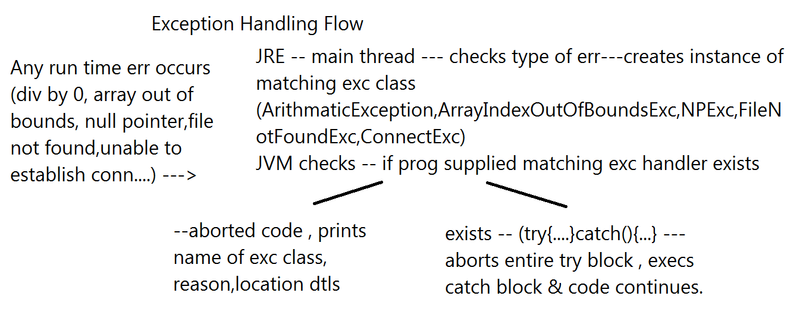
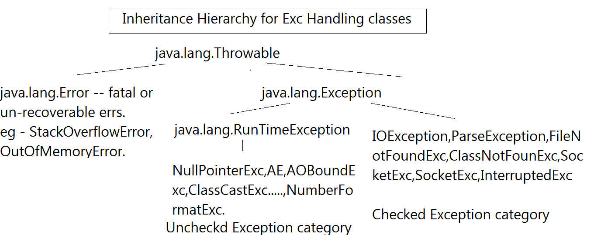
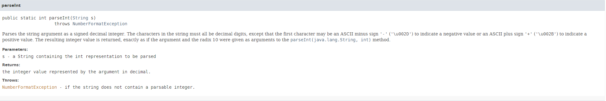
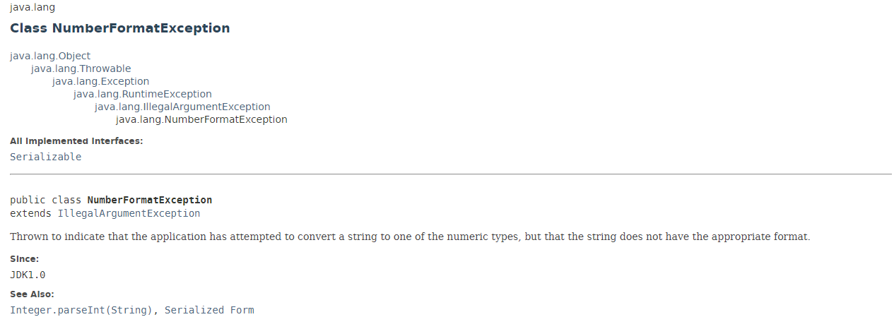

# Contents:
* [Exception Handling](#exception_handling)

# Exception Handling:

## Why Exception Handling?
- Even if there is a run-time error, the execution of code should not be avoided. Continuation of innocent and un-related keyword.  
- Separation of business logic and error handling.  
- Trigger for exception handling flow to begin: any run-time error/exception occurs.
- How the Exception Handling works: When JVM encounters a problem, it creates an instance of that exception class and it'll throw it the code. If this is not handled by the user's code(try..catch block.), it stops execution.  
- If the program execution stops due to a runtime exception, it'll give three important things in the logs to resolve it:
    - Fully qualified class name of the exception class.  
    - The reason behind the failure.  
    - Stacktrace when the program broke down.  

## Exception handling Flow:

## Inheritence hierarchy of Exception Handling:
  
Above Throwable is the Object class, but for the Exceptions, Throwable is sort of a super class for all exceptions.  
Under throwable are two concrete sub-classes- Error and Exception.  

### 'java.lang.Error' class and it's hierarchy:

All the classes extending the Error class or all the Runtime errors under the `java.lang.Error` hierarchy, tend to be fatal for the program execution. Once encounted, the program has to terminate and cannot be handled even using the try.. catch block. They are fatal or un-recoverable errors.  

### 'java.lang.Exception' class and it's hierarchy:

__NOTE:__ How to find out whether an exception is a checked or un-checked exception: If there is `java.lang.RuntimeException` in it's hierarchy under `java.lang.Exception`, it'll be an un-checked exception. Or else it'sll be a checked exception.  

JRE/JVM does n't differentiate between whether the exception is a checked or an un-checked exception. That means if there is an exception that occured during the execution of the program and it it's not handled JRE/JVM will terminate the program and handle it the same way, whether it is a checked or un-checked exception.  
But Java compiler is the one that differentites between them. Which means that javac forces the programmer to handle the checked Exception. So the compiler is making sure on it's end that even if there is an exception the program execution doesn't stop.  
Let's look at an example for this: For the `parseInt()` method of `java.lang.Integer` class:  
  
If something goes wrong during the execution of this statement/function, it'll throw `NumberFormatException`. The hierarchy of that exception is:  
  
So, when we look at this exception, this is an un-checked exception, as it comes under `RuntimeException`. Thus the compiler doesn't force us to handle this exception.  