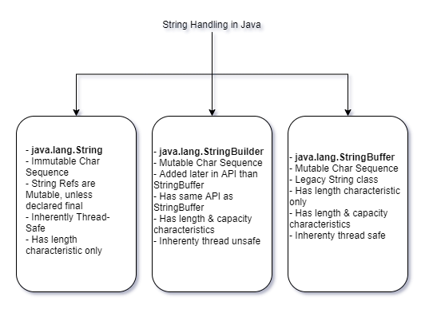
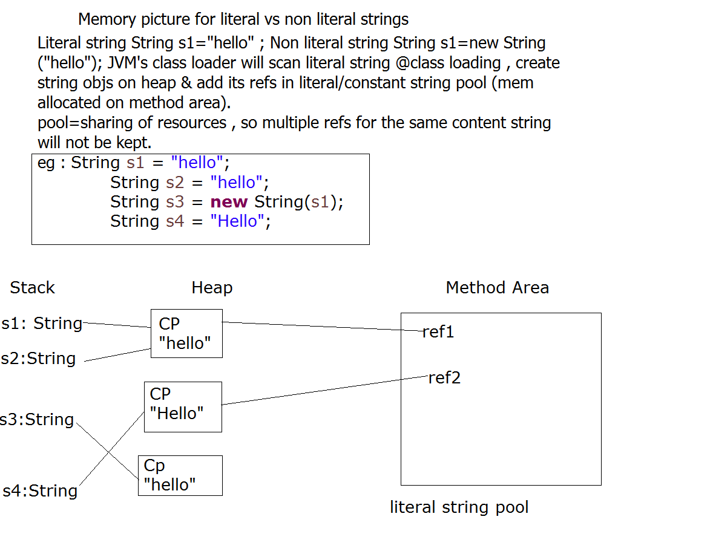

# Contents:
* [Exception Handling](#exception_handling)
* [String Handling in Java](#string_handling)

# Exception Handling:
<a name='exception_handling'></a>

## Why Exception Handling?
- Even if there is a run-time error, the execution of code should not be avoided. Continuation of innocent and un-related keyword.  
- Separation of business logic and error handling.  
- Trigger for exception handling flow to begin: any run-time error/exception occurs.
- How the Exception Handling works: When JVM encounters a problem, it creates an instance of that exception class and it'll throw it the code. If this is not handled by the user's code(try..catch block.), it stops execution.  
- If the program execution stops due to a runtime exception, it'll give three important things in the logs to resolve it:
    - Fully qualified class name of the exception class.  
    - The reason behind the failure.  
    - Stacktrace when the program broke down.  

## Exception handling Flow:


## Inheritence hierarchy of Exception Handling:
  
Above Throwable is the Object class, but for the Exceptions, Throwable is sort of a super class for all exceptions.  
Under throwable are two concrete sub-classes- Error and Exception.  

### 'java.lang.Error' class and it's hierarchy:

All the classes extending the Error class or all the Runtime errors under the `java.lang.Error` hierarchy, tend to be fatal for the program execution. Once encounted, the program has to terminate and cannot be handled even using the try.. catch block. They are fatal or un-recoverable errors.  

### 'java.lang.Exception' class and it's hierarchy:

__NOTE:__ How to find out whether an exception is a checked or un-checked exception: If there is `java.lang.RuntimeException` in it's hierarchy under `java.lang.Exception`, it'll be an un-checked exception. Or else it'sll be a checked exception.  

JRE/JVM does n't differentiate between whether the exception is a checked or an un-checked exception. That means if there is an exception that occured during the execution of the program and it it's not handled JRE/JVM will terminate the program and handle it the same way, whether it is a checked or un-checked exception.  
But Java compiler is the one that differentites between them. Which means that javac forces the programmer to handle the checked Exception. So the compiler is making sure on it's end that even if there is an exception the program execution doesn't stop.  
Let's look at an example for this: For the `parseInt()` method of `java.lang.Integer` class:  
  
If something goes wrong during the execution of this statement/function, it'll throw `NumberFormatException`. The hierarchy of that exception is:  
  
So, when we look at this exception, this is an un-checked exception, as it comes under `RuntimeException`. Thus the compiler doesn't force us to handle this exception.  

## try .. catch block:
```java
try {...} catch (exc1 e){}
try {...} catch (exc1 e){} catch (exc2 e) {} ....
try {...} catch (exc1 e){} catch (exc2 e) {}catch(Exception e){catch-all}
try {...} catch (exc1 e){} catch (exc2 | exc3 e) {}catch(Exception e){catch-all}
```

## Exception class Methods:

0. Exception(String mesg): Constructor, needed when creating custom exception classes.  
1. public String toString(): Returns name of exception class & reason.  
2. public String getMessage(): Returns error message of exception  
3. public void printStackTrace(): Gives the fully qualified class name of the exception class, reason behind the failure & stacktrace when the program broke down(i.e. exact location of where the exception occurred).  

## throws keyword:

Method declaration throws comma separated list of exception classes. eg :  
Integer class API : `public static int parseInt(String s) throws NumberFormatException {...}`  
FileReader API: `public FileReader(String fileName) throws FileNotFoundException {...}`  

- __throws:__ meant for javac
- __Meaning:__ Method MAY raise specified exception. Current method is NOT handling it , BUT its caller should handle.
- __Usage:__ Used for delegating excecption handling to the caller. It also lets the compiler know that this method can throw this exception, and thus the error handling should be done by the caller of this method.
- __Mandatory:__ Only mandatory in case of un-handled checked exceptions.  

__NOTE:__ We can even add `throws` clause in main, and we don't have to handle any unchecked exception.  
__NOTE:__ Usually `throws` clause is used because let's say main is calling 10 methods and we don't want to write try-catch in all those 10 methods as well, so then the method that we call can just throw the exception, and we'll handle it in main. Thus, `throws` clause is very helpful when building a centralized exception handling unit.   

## finally keyword in exception handling:

`finally`- block- When implmented, `finally` block ALWAYS survives- whether the program runs successfully or it encounters an exception.(except when we run System.exit(0))  
```java
try{...} catch (Exception e){....} finally {....}
try{...} catch (NullPointerException e){....} finally {....}
try {...} finally {....}
```
__Usage:__ For cleaning up(closing) of non-java resources(eg : file handles,db connection,socket cn...).  
__NOTE:__ In case of `try {...} catch(non-matching exception) {...} finally {...}` clause or `try {...} finally {...}`, if we encounter an excption, and JVM is not able to find a matching catch block, it'll first execute the `finally {...}` block and then JVM will keep looking for a matching catch block.  
__NOTE:__ If adding a super type of exception in `throws` class, there should be a matching catch block as well to catch that. Or else, it'll give a compiler error.  

## throw keyword in exception handling:
- Syntax: `throw <instane of the Throwable class>`.  
- Typically used for raising custom exceptions.  
- Example:
```java 
throw new NullPointerException("msg");
```
- Used by JVM to throw exceptions.
- Typically used(by developers) for raising custom exceptions  
- syntax :
```java
throw Throwable instance;
throw new NullPointerExc();
throw new InterruptedExc();
throw new Throwable("abc");
throw new Account(...);//javac err
throw new AccountOverdrawnExc("funds too low...");
```

## Difference between throws and throw keyword:
| `throws` | `throw` |
| - | - |
| keyoword in java , for exception handling | keyoword in java , for exception handling |
| can appear only in meth declaration | can only appear as java statement |
| mandatory for un-handled checked excs | Typically used for raising custom exceptions |
| Meaning --- Current method IS NOT handling the exception BUT its caller should handle. |  |
| throws' keyword allows delegation of exc handling to the caller. |  |
| Syntax/Example: | Syntax /Example: |
| Integer class API : `public static int parseInt(String s) throws NumberFormatException {...}` | `throw <Throwable instance>;` |
| FileReader API: `public FileReader(String fileName) throws FileNotFoundException {...}` |  __Legal:__ `throw new NullPointerException("msg");` |
| | __Illegal:__ `throw new Emp(…..);` as Emp is not a sub-class of Exception |
| | __Legal:__ `throw new SocketException("msg",e);` |
| | __Legal:__ `throw new InvalidInputException("invalid email");` |  

## Creating & using custom exceptions:
__Rules:__   
1. Create a pkged public class which extends Throwable(not reco but legal)/Exception(recommended)/Error(not reco but legal)/RuntimeExc(not reco but legal)  
2. CustExc(String msg) : overload the constr : to invoke the super-class construcot of the form `Exception (String msg)` OR  `CustExc(String msg,Throwable rootCause)` of super class method: `public Exception(String message,Throwable cause)`.  
__Problem Statement:__ Check the certain speed of the vehicle, and alert the driver(using custom exceptions) if the speed is too high or too low.  
__Implementation:__  For this two classes are needed:  
* Exception class- for defining the exception. This needs to be a sub-class of Exception class.  
* Main class for using/validating/handling this execption.

__Exception Class__:
```java
public class SpeedOutOfRangeException extends Exception{
	public SpeedOutOfRangeException(String mesg) {
		super(mesg);
	}
}
```

__Validating/Exception Handling class:__
```java
public class TestCustomException {
	public static final int MIN_SPEED;
	public static final int MAX_SPEED;
	static {
		MIN_SPEED = 40;
		MAX_SPEED = 140;
	}

	public static void main(String[] args) {
		Scanner sc = new Scanner(System.in);
		try {
			System.out.println("Enter speed");
			checkSpeed(sc.nextInt());
		} catch (Exception e) {
			e.printStackTrace();
		} finally {
			if (sc != null)
				sc.close();
		}
	}

	static void checkSpeed(int speed) throws Exception {
		if (speed < MIN_SPEED)
			throw new SpeedOutOfRangeException("U r driving too slow!!!!");
		if (speed > MAX_SPEED)
			throw new SpeedOutOfRangeException("U r driving too fast!!!!");
		System.out.println("speed within range....");
	}
}
```
__NOTE:__ In the constructor of the custom exception class, we are giving only the message and not the cause. There are other overridden constructor methods of the Exception class if we want to take leverage of those:  
- `public Exception()`:  
    Constructs a new exception with null as its detail message. The cause is not initialized, and may subsequently be initialized by a call to `Throwable.initCause`(java.lang.Throwable).

- `public Exception(String message)`:  
    Constructs a new exception with the specified detail message. The cause is not initialized, and may subsequently be initialized by a call to Throwable.initCause(java.lang.Throwable).   
    __Parameters__:  
        _message_ - the detail message. The detail message is saved for later retrieval by the `Throwable.getMessage()` method.  

- `public Exception(String message, Throwable cause)`:  
    Constructs a new exception with the specified detail message and cause.  
    Note that the detail message associated with cause is not automatically incorporated in this exception's detail message.  

    __Parameters__:  
        _message_ - the detail message (which is saved for later retrieval by the Throwable.getMessage() method).  
        _cause_ - the cause (which is saved for later retrieval by the Throwable.getCause() method). (A null value is permitted, and indicates that the cause is nonexistent or unknown.)  

- `public Exception(Throwable cause)`:  
    Constructs a new exception with the specified cause and a detail message of (cause==null ? null : cause.toString()) (which typically contains the class and detail message of cause). This constructor is useful for exceptions that are little more than wrappers for other throwables (for example, PrivilegedActionException).  

    __Parameters__:  
        _cause_ - the cause (which is saved for later retrieval by the Throwable.getCause() method). (A null value is permitted, and indicates that the cause is nonexistent or unknown.)
    
- `protected Exception(String message, Throwable cause, enableSuppression, boolean writableStackTrace)`:  
    Constructs a new exception with the specified detail message, cause, suppression enabled or disabled, and writable stack trace enabled or disabled.

    __Parameters__:  
        _message_ - the detail message.  
        _cause_ - the cause. (A null value is permitted, and indicates that the cause is nonexistent or unknown.)  
        _enableSuppression_ - whether or not suppression is enabled or disabled  
        _writableStackTrace_ - whether or not the stack trace should be writable  

## Another implementation/Improved implementation example:

- Core class- [Emp.java](../code_files/day6/classwork/src/com/app/core/Emp.java)  
- Custom Exception class- [EmpHandlingException.java](../code_files/day6/classwork/src/cust_excs/EmpHandlingException.java)  
- Validation Rules class- [ValidationRule.java](../code_files/day6/classwork/src/utils/ValidationRules.java)  
- Tester class- [TestEmpOrg.java](../code_files/day6/classwork/src/com/app/tester/TestEmpOrg.java)

# String Handling in Java:
<a name='string_handling'></a>

In Java, String handling can be performed using three classes. Primarily:  
- String class  
- StringBuilder class
- StringBuffer class

More about these classes:  
  
__NOTE:__ String class is immutable, but both StringBuilder & StringBuffer are mutable. StringBuilder & StringBuffer has capability/API to grow/shrink the object structure.  
__NOTE:__ Here when it says this is inherently threadsafe, it's because in order to access the object by any thread, we don't have to apply any locks, since it is immutable anyways and the threads are not able to change anything.  

## String class API:
Important String class constructors:  
1. `String(byte[] bytes);`: byte[] -> String converter  
2. `String(char[] chars);`: char[] -> String converter  
3. `String (byte[] bytes,int offset,int len);`: byte[] -> String converter from the specified offset, specified len no of bytes will be converted.  
	eg . `String s=new String(bytes,3,4);`: String will contain bytes[3]-bytes[6]
4. `String(char[] ch,int offset,int len);`
5. `String(String s);`

## String literal:
When defining a String object using double quotes without new keyword. Example:
```java
String str = "Hello";

// And if we perform operations like
str.concat("Hi");	// Concats two strings.
```
The second statement doesn't actually update the original object, as Strings are immutable. The contents of str is still the same as it was earlier. It is still pointing to the object containing "Hello". The second statement creates a new String object with contents "HelloHi", but the reference is still pointing to the first object. If you want str reference to have the newer value, we'll have to update the statement as `str = str.concat("Hi");` Here the contents of the object doesn't change, but str is pointing to the newly created object. The similar happens if we use the String API methods like `toUpperCase()` & `replace()`.  

## Checking String equality:
Looking at the code should be self explainatory:
```java
String s1=new String("abc");
String s2=new String("abc");
String s3=new String("Abc");
String s4 = "abc";
String s5 = "abc";
System.out.println(s1==s2);					//false
System.out.println(s4==s5);					//true	--due to the concept of string literal pool
System.out.println(s1.equals(s2));			//true
System.out.println(s1.equals(s3));			//false
System.out.println(s1.equalsIgnoreCase(s3));//true
```

## String Literal Pool:
During the class loading phase, JVM will first load the user defined classes and then look for all the string literals, if it encounters any String literals, it'll load the String class into method area. And String Class maintains a __Literal/Constant String Pool__. And at the beginning, this pool is empty. This pool is going to maintain the references of literal Strings. So when JVM encounters a String defination using String literals, after the String class is loaded, it'll first create an Object on heap, and it's reference is stored in _Literal String Pool_. So the next time someone tries to use the same String literal, it'll just use the reference of the earlier Literal String and no new object is gonna be created. Until this point the main method hasn't started executtion. Thus an Object has been created of String type and the assignment of string literal references to the Literal String pool happens before even the execution of the program starts. Once the program execution starts, if the interpreter comes across statements of the same String literal defination. it'll copy the reference from the String literal pool. Summary:  
  

In the above picture, the class pointer will point to the String class.  
__NOTE:__ Pool above means the collection of Sting literals. Even after the references in the stack are nullified, the String literal object won't be marked for Garbage collector, as there are references still pointing to this object, in String Literal Pool. String Literal Pool is also called as __Constant Tables__.  

